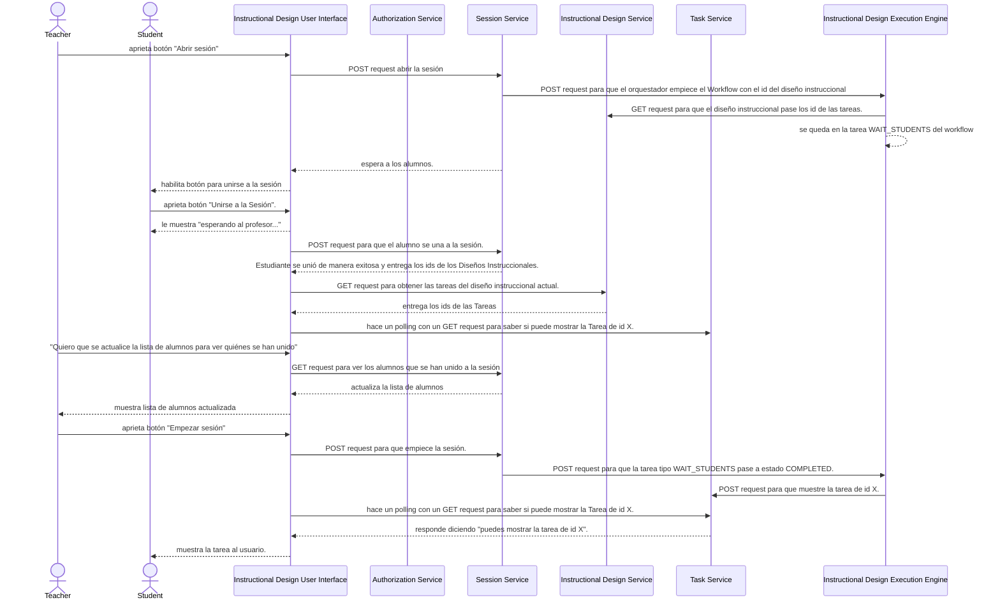

```mermaid
sequenceDiagram
	actor teacher as Teacher
	actor student as Student
  participant ui as Instructional Design User Interface
	participant auth as Authorization Service
	participant session as Session Service
	participant instructionalDesign as Instructional Design Service
  participant task as Task Service
	participant engine as Instructional Design Execution Engine

	teacher ->> ui: aprieta botón "Abrir sesión"
	ui ->> session: POST request abrir la sesión
	session ->> engine: POST request para que el orquestador empiece el Workflow con el id del diseño instruccional
	engine ->> instructionalDesign: GET request para que el diseño instruccional pase los id de las tareas.
	engine -->> engine: se queda en la tarea WAIT_STUDENTS del workflow
	%% ------------------------------ %%
	session -->> ui: espera a los alumnos.
	ui -->> student: habilita botón para unirse a la sesión
	student ->> ui: aprieta botón "Unirse a la Sesión".
	ui -->> student: le muestra "esperando al profesor..."
	ui ->> session: POST request para que el alumno se una a la sesión.
	session -->> ui: Estudiante se unió de manera exitosa y entrega los ids de los Diseños Instruccionales.
	ui ->> instructionalDesign: GET request para obtener las tareas del diseño instruccional actual.
	instructionalDesign -->> ui: entrega los ids de las Tareas
	ui ->> task: hace un polling con un GET request para saber si puede mostrar la Tarea de id X.
	%% ------------------------------ %%
	teacher ->> ui: "Quiero que se actualice la lista de alumnos para ver quiénes se han unido"
	ui ->> session: GET request para ver los alumnos que se han unido a la sesión
	session -->> ui: actualiza la lista de alumnos
	ui -->> teacher: muestra lista de alumnos actualizada
	%% ------------------------------ %%
	teacher ->> ui: aprieta botón "Empezar sesión"
	ui ->> session: POST request para que empiece la sesión.
	session ->> engine: POST request para que la tarea tipo WAIT_STUDENTS pase a estado COMPLETED.
	engine ->> task: POST request para que muestre la tarea de id X.
	ui ->> task: hace un polling con un GET request para saber si puede mostrar la Tarea de id X.
	task -->> ui: responde diciendo "puedes mostrar la tarea de id X".
	ui -->> student: muestra la tarea al usuario.
 
```